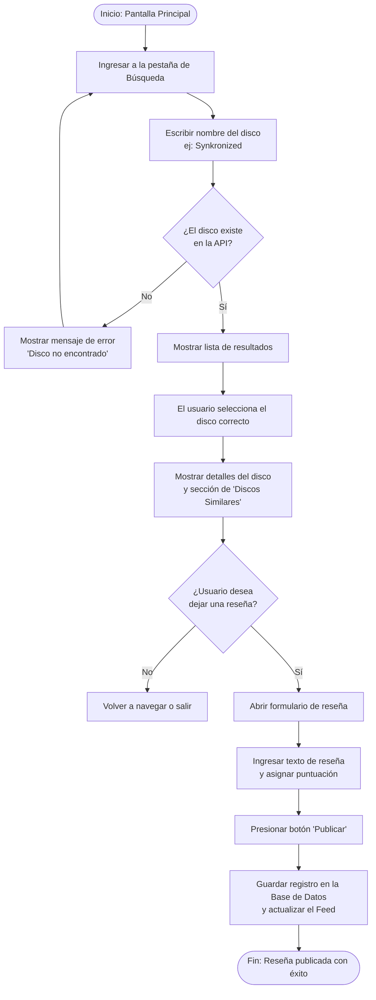
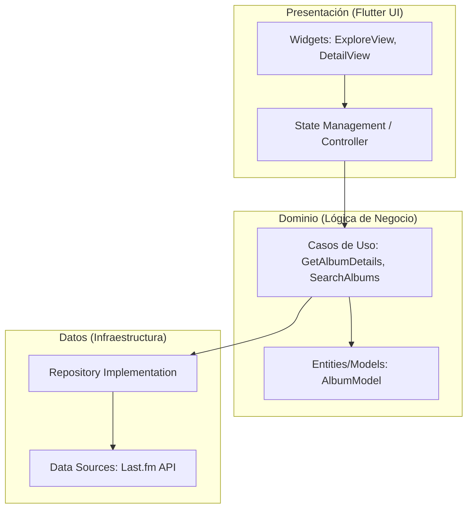
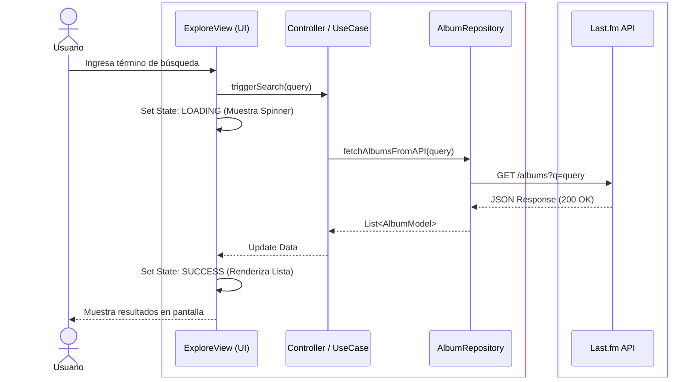
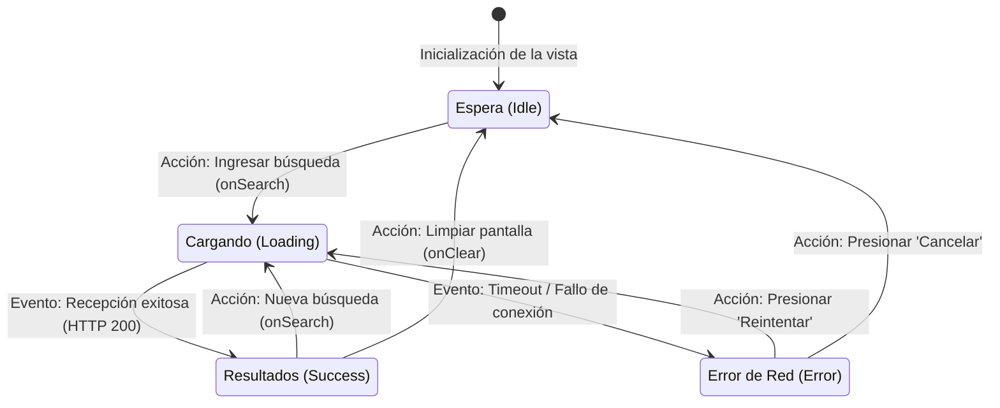

# AlbumLog

AlbumLog es una aplicación móvil diseñada para fomentar el descubrimiento, registro y recomendación de álbumes musicales. La plataforma permite a los usuarios ingresar sus discos preferidos para recibir recomendaciones algorítmicas de álbumes similares basadas en metadatos avanzados, además de llevar una bitácora personal de escuchas, gestionar colecciones locales y publicar reseñas con calificaciones estructuradas.

## Características y Requerimientos

### Funcionalidades Core
* **Sistema de Recomendación:** Descubrimiento automatizado de música similar basado en el catálogo global.
* **Notificaciones en Red:** Alertas síncronas ante interacciones en el feed o nuevas publicaciones de la red de contactos.
* **Gestión de Estado y Caché:** Optimización del consumo de datos mediante el almacenamiento local en caché de imágenes de portadas y del feed persistente.

### Requerimientos de Usuario (User Stories)
* **Descubrimiento Rápido:** Visualizar una lista de álbumes en tendencia mundial.
* **Patrón Vista-Detalle:** Seleccionar un álbum específico para desplegar su portada en alta definición, metadatos y discos relacionados.
* **Navegación Unificada:** Acceder a un sistema centralizado de secciones mediante pestañas de acceso rápido.

### Especificaciones de Ingeniería
* **Funcionales:** Implementación estricta del patrón estructural Master-Detail, pasarela inicial de tipo Splash Screen para transiciones de carga, pantallas informativas y menús de navegación persistentes.
* **No Funcionales:** Arquitectura visual basada en un ThemeData global centralizado para erradicar la codificación dura (hardcoding) de colores y estilos. Alta coherencia semántica en la disposición de tipografías y recursos gráficos.

---

## Instrucciones de Uso y Flujos de Navegación

1. **Inicialización:** Al iniciar la aplicación, deslice hacia abajo para actualizar y explorar las características dinámicas del feed principal.
2. **Navegación Base:** Utilice el menú fijo ubicado en la parte inferior de la pantalla para transitar de forma rápida entre los módulos de la aplicación: Inicio, Explorar, Perfil y About.
3. **Módulo de Exploración:** Seleccione el ícono de la brújula (Explorar) para desplegar la colección dinámica de música en tendencia.
4. **Flujo de Detalle:** Toque cualquier elemento de la lista para abrir la interfaz detallada del álbum. Para retornar a la pantalla anterior, utilice la flecha de navegación nativa dispuesta en la esquina superior izquierda.
5. **Módulos Complementarios:** Acceda a Perfil para la administración de la cuenta local (en fase de expansión) y a Info para documentación de soporte técnico y ayuda al usuario.

### Diagrama de Flujo del Usuario (User Journey)

---

## Arquitectura del Sistema

La solución de software adopta los principios de Clean Architecture estructurada bajo el patrón de presentación MVVM (Model-View-ViewModel). Esto aísla por completo el núcleo del negocio de los frameworks de infraestructura, facilitando pruebas automatizadas aisladas.

### 1. Diagrama Estructural de Capas

### 2. Diagrama de Secuencia (Módulo de Consulta Asíncrona)

El siguiente diagrama detalla la interacción cronológica entre el actor del sistema, los componentes desacoplados de la arquitectura interna y el endpoint remoto.

### 3. Diagrama de Máquina de Estados (Ciclo de Vida de la Interfaz)

Modelado de las condiciones mutables de la vista de exploración durante el consumo transaccional de datos:

---

## Stack Tecnológico y Dependencias

* **Framework:** Flutter SDK (^3.11.3)
* **Lenguaje:** Dart
* **Arquitectura:** MVVM (Model-View-ViewModel)
* **Gestión de Estado Reactivo:** provider (^6.1.5+1)
* **Servicios en la Nube:** Ecosistema Firebase (firebase_core, cloud_firestore, firebase_auth, google_sign_in)
* **Persistencia en Almacenamiento Local:** shared_preferences (^2.5.5)
* **Cliente HTTP:** http (^1.6.0) para Last.fm API
* **Utilidades Nativas:** url_launcher (Redirección de correos), flutter_launcher_icons (Iconos adaptativos)

---

## Conclusiones del Registro de Decisiones Arquitectónicas (ADR)

* **Adopción del Patrón MVVM con Estado Reactivo:** Separar la interfaz de usuario de la lógica de negocio mediante el patrón Model-View-ViewModel y gestionar el estado con el framework provider. Consecuencias: Desacoplamiento total. Las vistas operan como componentes declarativos que únicamente reaccionan a mutaciones de estado. Esto facilita la inyección de dependencias, permite aislar la lógica para pruebas unitarias y habilita la escalabilidad modular sin requerir la refactorización de la UI.
* **Persistencia Híbrida Tolerante a Fallos:** Implementar almacenamiento local (SharedPreferences) como fuente de verdad principal para operaciones offline, complementado con una arquitectura cloud (Firebase Auth) para la identidad descentralizada. Consecuencias: Garantiza una latencia cero en la consulta de álbumes calificados y disponibilidad continua sin depender de la conectividad de red.
* **Migración de Infraestructura de Datos (iTunes API a Last.fm API):** Durante la Prueba de Concepto (POC) del proyecto, se utilizó la API pública de iTunes. Tras el análisis de respuestas JSON, se determinó que su modelo de datos es estrictamente transaccional, lo cual limitaba severamente la obtención de datos. Se decidió refactorizar la capa de infraestructura (Data Sources) para abandonar iTunes API y adoptar la API de Last.fm como fuente definitiva. Consecuencias: Last.fm provee una arquitectura diseñada para el descubrimiento y catalogación musical. Esta migración permitió mejorar los modelos de dominio con datos (etiquetas de género precisas, resúmenes wiki de álbumes y métricas globales), mejorando exponencialmente la calidad del contenido renderizado en la DetailView sin añadir carga computacional de parseo extra al cliente.

---

## Aseguramiento de Calidad (Beta Testing)

El proceso de QA contó con la participación de 13 usuarios de prueba, quienes evaluaron la aplicación bajo tres métricas clave: Usabilidad, Contenido y Compartir. Cada criterio fue puntuado en una escala del 1 al 5.

A continuación, se detalla el promedio de calificación obtenido por cada pregunta:

| Categoría | Criterio Evaluado (Pregunta) | Promedio (sobre 5.00) | Representación |
| :--- | :--- | :---: | :---: |
| **Usabilidad** | ¿Qué tan fácil fue navegar a través de la aplicación? | **5.00** | 5.0 Estrellas |
| **Usabilidad** | ¿Pudiste completar tus tareas sin problemas? | **4.85** | 4.8 Estrellas |
| **Usabilidad** | Diseño y claridad de la interfaz gráfica | **4.69** | 4.7 Estrellas |
| **Contenido** | ¿El contenido de la aplicación fue útil para ti? | **4.08** | 4.1 Estrellas |
| **Contenido** | Adaptación del contenido a tus expectativas | **4.62** | 4.6 Estrellas |
| **Contenido** | Claridad en la presentación de la información | **4.85** | 4.8 Estrellas |
| **Compartir** | Probabilidad de recomendar la aplicación a un amigo | **4.69** | 4.7 Estrellas |
| **Compartir** | ¿Cómo te sentirías al compartir esta aplicación? | **4.77** | 4.8 Estrellas |
| **Compartir** | Utilidad de la app para personas cercanas a ti | **4.69** | 4.7 Estrellas |

> **Calificación Promedio del Sistema: 4.69 / 5.00**

### Resumen Analítico del Beta Testing

A partir de las métricas recopiladas, se levantó el siguiente análisis técnico sobre el estado actual de la aplicación y la ruta de evolución del producto:

**Fortalezas del Sistema (Lo que funcionó)**
* **Navegación Intuitiva:** La implementación del BottomNavigationBar fijo fue un acierto absoluto (5.00/5.00), garantizando una curva de aprendizaje nula.
* **Estabilidad Transaccional:** La arquitectura MVVM y el CRUD local operaron sin interrupciones, bloqueos ni errores de tipo, asegurando un flujo de usuario fluido.
* **Claridad Estructural:** El renderizado del JSON consumido desde la API se presentó de forma limpia y altamente comprensible en la UI.

**Oportunidades de Mejora**
* **Profundidad de Contenido:** Fue el área de menor rendimiento (4.08/5.00). Los usuarios indicaron que visualizar solo la portada y el título no genera suficiente valor agregado.
* **Refinamiento Visual:** Aunque funcional, la interfaz gráfica requiere modernización y más interacciones para sentirse como un producto final más pulido.
* **Factor Social:** La aplicación carece de incentivos o herramientas visuales que motiven a los usuarios a compartir sus reseñas de forma orgánica.

**Roadmap y Trabajos Futuros**
1. **Enriquecimiento de Dominio:** Escalar el consumo de la API de Last.fm para incluir listas de canciones (Tracklists), duración total del disco y enlaces directos a plataformas de Streaming.
2. **Sistema de Diseño (UI/UX):** Implementar transiciones animadas, pantallas de carga y optimizar el contraste del Modo Oscuro.

---

## Distribución y Descarga Directa

El archivo ejecutable final:
**[Descargar AlbumLog_v1.0.apk](./apk/AlbumLog_v1.0.apk)**
