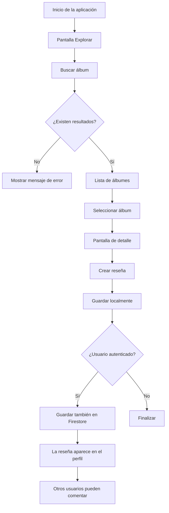
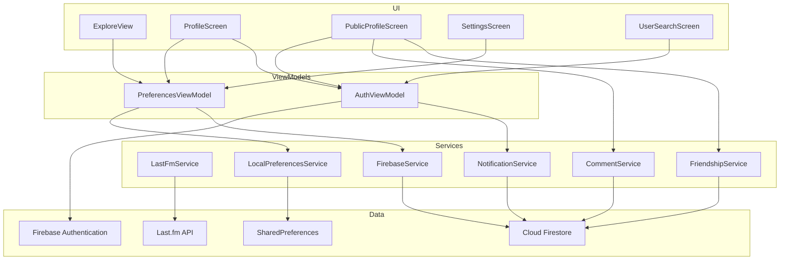

# AlbumLog

AlbumLog es una aplicación móvil desarrollada con Flutter que permite descubrir álbumes musicales mediante la API de Last.fm, calificarlos, escribir reseñas personales y compartirlas con otros usuarios. Además, incorpora autenticación con Google, perfiles públicos, sistema de amistades, comentarios, sincronización con Firebase y almacenamiento local para ofrecer una experiencia híbrida tanto en línea como fuera de línea.

---

# Características principales

## Exploración musical

- Búsqueda de álbumes utilizando la API pública de Last.fm.
- Visualización de portadas en alta resolución.
- Pantalla de detalle con información del álbum.
- Manejo de errores de conexión, servidor y tiempo de espera.

## Reseñas personales

- Calificación mediante un sistema de estrellas.
- Comentarios personales para cada álbum.
- Almacenamiento local mediante SharedPreferences.
- Sincronización automática con Firebase cuando el usuario inicia sesión.

## Sistema social

- Inicio de sesión mediante Google.
- Perfil público de cada usuario.
- Búsqueda de usuarios registrados.
- Envío y recepción de solicitudes de amistad.
- Aceptar o rechazar solicitudes.
- Comentarios en las reseñas de otros usuarios.
- Sistema de notificaciones para nuevas interacciones.

## Personalización

- Modo claro y modo oscuro.
- Configuración de nombre de usuario.
- Selección del género musical favorito.
- Soporte para Español e Inglés mediante Flutter Localization.

## Calidad

- Manejo de errores durante la carga de datos.
- Persistencia híbrida (local y en la nube).
- Internacionalización de toda la interfaz.

---

# Funcionalidades implementadas

- Búsqueda de álbumes mediante Last.fm.
- Visualización de detalles de álbumes.
- Crear reseñas.
- Calificar álbumes.
- Compartir reseñas.
- Persistencia local.
- Sincronización con Firebase.
- Inicio de sesión con Google.
- Perfil público.
- Sistema de comentarios.
- Sistema de amistades.
- Notificaciones.
- Modo oscuro.
- Internacionalización.
- Pantalla About.

---

# Flujo de navegación


```mermaid
flowchart TD

A[Inicio de la aplicación] --> B[Pantalla Explorar]

B --> C[Buscar álbum]

C --> D{¿Existen resultados?}

D -->|No| E[Mostrar mensaje de error]

D -->|Sí| F[Lista de álbumes]

F --> G[Seleccionar álbum]

G --> H[Pantalla de detalle]

H --> I[Crear reseña]

I --> J[Guardar localmente]

J --> K{¿Usuario autenticado?}

K -->|Sí| L[Guardar también en Firestore]

K -->|No| M[Finalizar]

L --> N[La reseña aparece en el perfil]

N --> O[Otros usuarios pueden comentar]
```

---

# Arquitectura

La aplicación implementa el patrón **MVVM (Model-View-ViewModel)** utilizando Provider para la gestión del estado.


```mermaid
flowchart TB

subgraph UI
A[ExploreView]
B[ProfileScreen]
C[PublicProfileScreen]
D[SettingsScreen]
E[UserSearchScreen]
end

subgraph ViewModels
F[PreferencesViewModel]
G[AuthViewModel]
end

subgraph Services
H[LastFmService]
I[FirebaseService]
J[CommentService]
K[FriendshipService]
L[NotificationService]
M[LocalPreferencesService]
end

subgraph Data
N[Last.fm API]
O[Firebase Authentication]
P[Cloud Firestore]
Q[SharedPreferences]
end

A --> F
B --> F
B --> G
C --> G
D --> F
E --> G

F --> M
F --> I

G --> O
G --> L

C --> J
C --> K

I --> P
J --> P
K --> P
L --> P
M --> Q
H --> N
```

---

# Arquitectura de carpetas

```text
lib/
│
├── l10n/
│
├── models/
│
├── services/
│   ├── comment_service.dart
│   ├── firebase_service.dart
│   ├── friendship_service.dart
│   ├── lastfm_service.dart
│   ├── local_preferences_services.dart
│   └── notification_service.dart
│
├── ui/
│   └── screens/
│
├── viewmodel/
│   ├── auth_viewmodel.dart
│   └── preferences_viewmodel.dart
│
├── firebase_options.dart
│
└── main.dart
```

---

# Tecnologías utilizadas

| Tecnología | Uso |
|------------|-----|
| Flutter | Framework principal |
| Dart | Lenguaje |
| Provider | Gestión de estado |
| Firebase Authentication | Inicio de sesión |
| Cloud Firestore | Base de datos |
| Firebase Cloud Messaging | Notificaciones |
| SharedPreferences | Persistencia local |
| Last.fm API | Obtención de información musical |
| Google Sign-In | Autenticación |
| flutter_localizations | Internacionalización |
| http | Consumo de la API |
| flutter_dotenv | Variables de entorno |

---

# Internacionalización

La aplicación soporta múltiples idiomas mediante Flutter Localization.

Idiomas disponibles:

- Español
- Inglés

Todos los textos de la aplicación se encuentran centralizados dentro de la carpeta:

```text
lib/l10n/
```

---

# Persistencia de datos

AlbumLog utiliza una arquitectura híbrida.

## Almacenamiento local

Se almacena mediante SharedPreferences:

- Nombre de usuario.
- Modo oscuro.
- Género favorito.
- Reseñas de álbumes.

## Almacenamiento en la nube

Cuando el usuario inicia sesión, se sincronizan automáticamente:

- Perfil del usuario.
- Reseñas.
- Comentarios.
- Solicitudes de amistad.
- Lista de amigos.
- Notificaciones.

Toda esta información se almacena en Cloud Firestore.

---

# Variables de entorno

Para ejecutar correctamente la aplicación es necesario crear un archivo **.env** en la raíz del proyecto.

Debe contener las siguientes variables:

```env
FIREBASE_API_KEY_WEB=
FIREBASE_API_KEY_ANDROID=
FIREBASE_API_KEY_IOS=
FIREBASE_API_KEY_MACOS=
FIREBASE_API_KEY_WINDOWS=

LASTFM_API_KEY=
```

Las claves no se incluyen por motivos de seguridad.

La API Key de Last.fm puede obtenerse desde:

https://www.last.fm/api/account/create

---

# Instalación

Instalar las dependencias:

```bash
flutter pub get
```

Ejecutar la aplicación:

```bash
flutter run
```

Generar un APK:

```bash
flutter clean
flutter pub get
flutter build apk --release
```

---

# Trabajos futuros

- Sincronización bidireccional entre almacenamiento local y nube.
- Edición de reseñas.
- Eliminación de comentarios.
- Sistema de seguidores.
- Recomendaciones personalizadas.
- Filtros avanzados por género.
- Integración con Spotify.
- Estadísticas musicales.
- Notificaciones Push en tiempo real.
- Cambio manual de idioma desde Configuración.
- Caché de imágenes para mejorar el rendimiento.

---

# Autores

Proyecto desarrollado utilizando Flutter, Firebase y Last.fm API como parte del desarrollo de una aplicación móvil enfocada en el descubrimiento, organización y socialización de álbumes musicales.